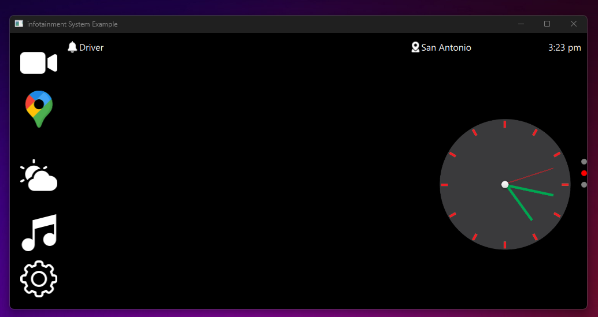
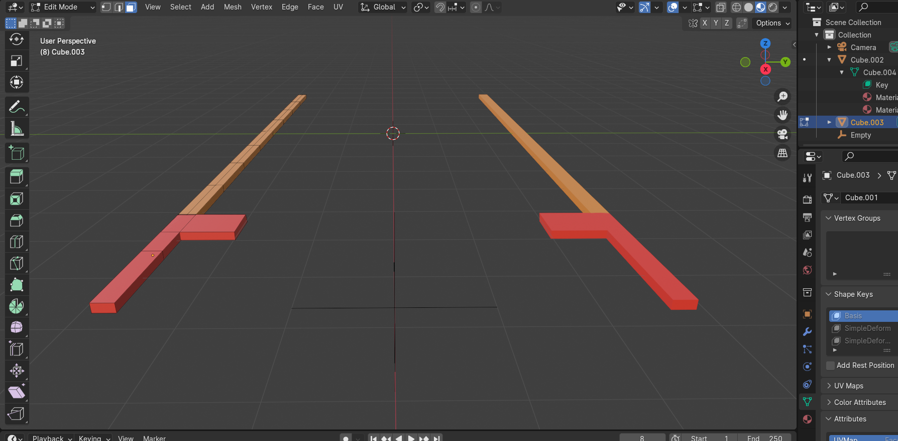
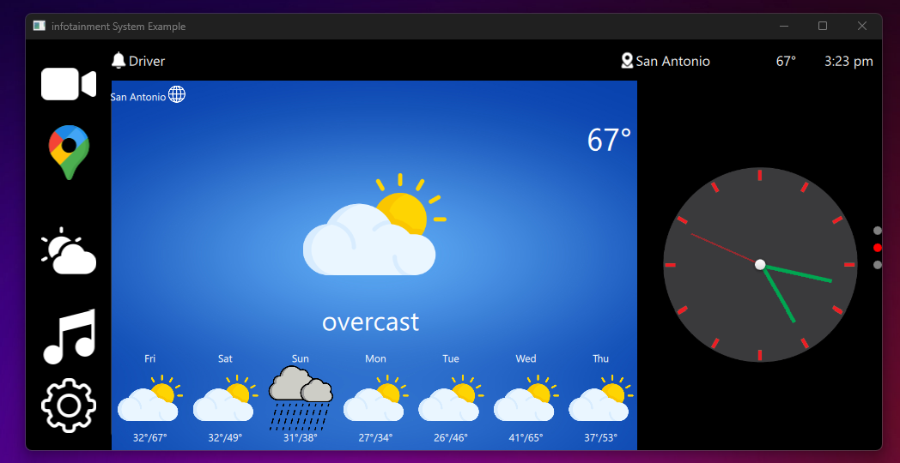
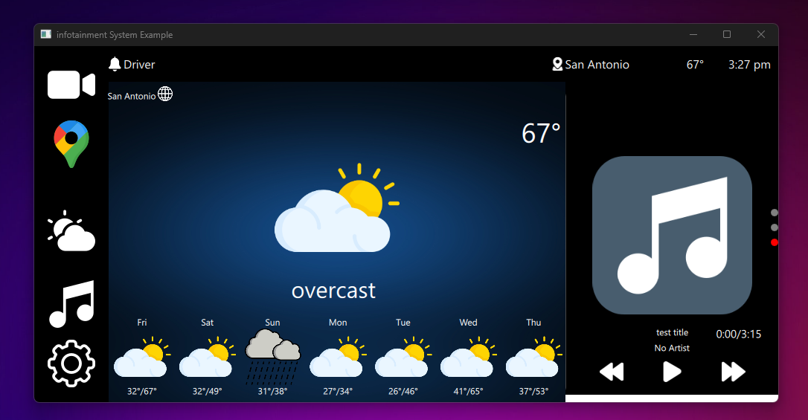
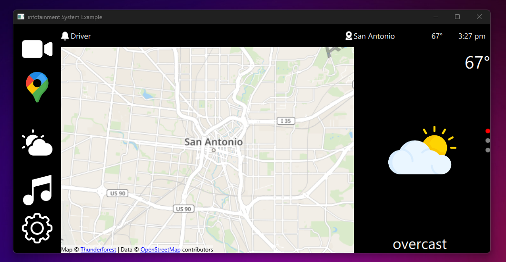
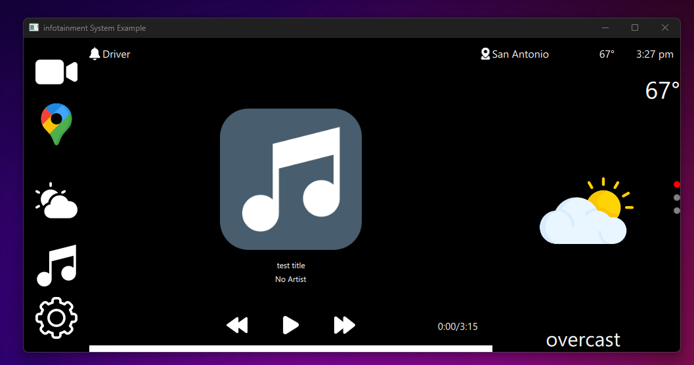

# infosystem
Infotainment system built with Qt Quick 

Main Screen 
(Under Construction) 

Backup Camera
I used the QML Camera type for this, as I didn't need the features offered by the QML type. All I wanted it to do was display video output.

Backup Camera Guidelines Implementation
I could not find any information anywhere on how to implement backup camera guidelines. After some research,
which included drawing the lines at runtime, I went with an implementation I found the easiest to execute. 
The solution was to create the guidelines in Blender and use Qt Quick 3D to display and control them.

Weather 
I implemented weather into an existing project and introduced night and day views, a feature the original project lacked.

Maps 
I haven't really done much with maps yet. Currently, I'm working on this (well, actually, I'm working on everything).

MediaPlayer 

I created a media player using the C++ class implementation instead of QML because I found it easier to work with. 
Additionally, a smaller version of the media player is implemented for the side view.

Setting is under construction at this point as well.  
